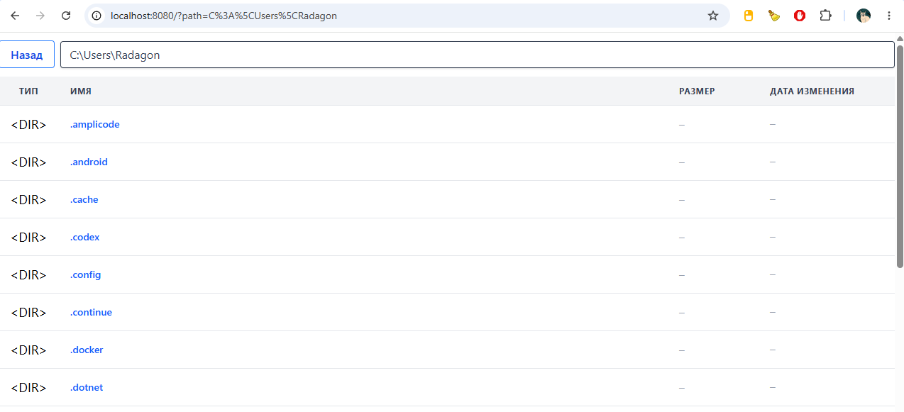
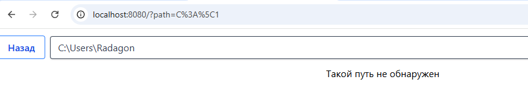
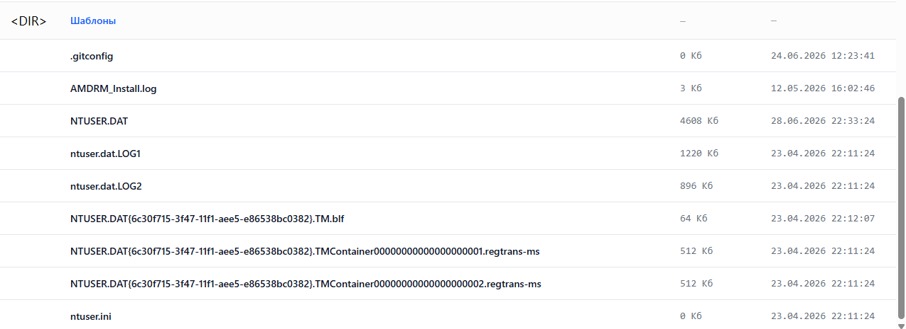
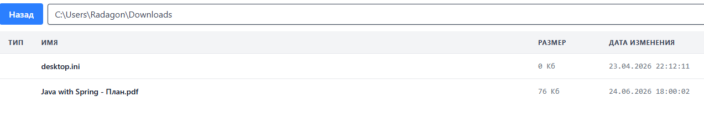

# РАбота файлового менеджера

### Домашняя директоря

### Путь не обнаружен (в строке сразу на доманюю перекидывает)
### (можно в адресной строке неверный путь увидеть)

### На фото выше только папки, отображение файлов:

